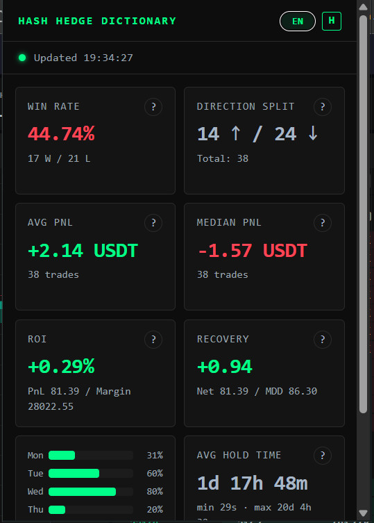

# Hash Hedge Diary

> Maintainers note: when updating the VirusTotal report URL, update the same URL in `pages/index.html` (VirusTotal button).

Hash Hedge Diary is a Chrome extension that displays advanced trading statistics for your closed CFD positions on [hashhedge.com](https://hashhedge.com).

---

## What it does

The extension reads your trade history directly from the HashHedge API using the same authentication that the website already uses — no passwords or API keys are required. It then calculates a set of statistics and shows them in a compact popup panel.

**Available metrics:**

| Metric | Description |
|---|---|
| Win Rate | Share of profitable trades |
| Direction Split | LONG vs SHORT trade counts |
| Avg PnL | Mean profit/loss per trade |
| Median PnL | Median profit/loss (less affected by outliers) |
| ROI | Return on used margin |
| Recovery Factor | Net profit ÷ max drawdown |
| Best Days | Win rate % by day of week (Mon–Sun) |
| Avg Hold Time | Average time a position is kept open |

The popup is available in **English** and **Russian** and remembers your language preference.

---

## Installation (unpacked extension)

> Chrome Web Store publication is not planned. Install manually as a developer extension.

1. Download or clone this repository to your computer.
2. Open Chrome and navigate to `chrome://extensions`.
3. Enable **Developer mode** (toggle in the top-right corner).
4. Click **Load unpacked** and select the `plugins/chrome` folder (it contains `plugins/chrome/manifest.json`).
5. The extension icon will appear in the toolbar. Pin it for easy access.

### First use

1. Make sure you are logged in to [hashhedge.com](https://hashhedge.com).
2. Open the **Trade History** page on the site at least once. The extension passively captures the authentication headers from that request.
3. Click the extension icon in the toolbar — statistics will load automatically.
4. Use the **↻ Refresh** button to reload the latest data at any time.

---

## Permissions

| Permission | Why it is needed |
|---|---|
| `webRequest` | Passively captures auth headers from the page's own requests to `cb.hashhedge.com`. No data is intercepted or sent anywhere else. |
| `storage` | Stores captured auth headers in session storage and saves language preference. |
| `cookies` | Used as a fallback auth method if headers are not yet available. |

---

## Security

This extension is automatically scanned for security threats using **VirusTotal** on every commit and pull request.

- ✅ **Security badges** at the top of this README show the scan status
- 🔍 **Automated checks** run on push and PR using GitHub Actions
- 🛡️ **Results are public** — you can verify the scan on VirusTotal directly

### Manual Security Verification

You can manually scan this repository:

1. Download or clone the repository ZIP file
2. Visit [virustotal.com](https://www.virustotal.com/)
3. Upload the file and verify the results
4. You can also use the `sha256sum` hash of this repository to check it on VirusTotal

### Setting up VirusTotal Scanning (for repository maintainers)

To enable automated VirusTotal scanning on your fork:

1. Create a free VirusTotal account at [virustotal.com](https://www.virustotal.com/)
2. Generate an API key from your profile settings
3. Add it to your GitHub repository as a secret:
   - Go to **Settings → Secrets and variables → Actions**
   - Click **New repository secret**
   - Name: `VIRUSTOTAL_API_KEY`
   - Value: Your VirusTotal API key
4. The scan will run automatically on the next push

---

## Support

If this extension is useful to you, you can open the support page with crypto wallet details here:

- [Support Hash Hedge Diary](https://iskatel-ua.github.io/hash-hedge-diary/index.html)

---

## Disclaimer

**This extension is an independent, unofficial tool and is not affiliated with, endorsed by, or connected to HashHedge or its operators in any way.**

- The extension does not store, transmit, or share any of your personal data or trading information with any third party. All computation happens locally in your browser.
- The statistics provided are for **informational purposes only** and do not constitute financial advice, investment recommendations, or trading signals.
- Past performance of any trading strategy shown by this extension does not guarantee future results.
- The authors of this extension accept **no responsibility** for any trading decisions made based on the data displayed, or for any financial losses that may result.
- Use at your own risk. Always verify important figures directly on the HashHedge platform.

---

---

# Hash Hedge Diary (Русский)

Hash Hedge Diary (дневник) — расширение для Chrome, которое отображает расширенную торговую статистику по закрытым CFD-позициям на [hashhedge.com](https://hashhedge.com).

---

## Что делает расширение

Расширение считывает историю сделок напрямую из API HashHedge, используя ту же аутентификацию, которую уже применяет сам сайт — пароли и API-ключи не нужны. Затем вычисляется набор метрик и отображается в компактном всплывающем окне.

**Доступные метрики:**

| Метрика | Описание |
|---|---|
| Винрейт | Доля прибыльных сделок |
| Распределение направлений | Количество сделок LONG и SHORT |
| Средний PnL | Средняя прибыль/убыток на сделку |
| Медиана PnL | Медианная прибыль/убыток (менее чувствительна к выбросам) |
| ROI | Доходность на использованную маржу |
| Восстановление | Чистая прибыль ÷ максимальная просадка |
| Лучшие дни | Винрейт % по дням недели (Пн–Вс) |
| Ср. время в сделке | Среднее время удержания позиции |

Интерфейс доступен на **английском** и **русском** языках; выбор языка сохраняется.

---

## Установка (неупакованное расширение)

> Публикация в Chrome Web Store не планируется. Установка выполняется вручную в режиме разработчика.

1. Скачайте или склонируйте репозиторий на компьютер.
2. Откройте Chrome и перейдите на страницу `chrome://extensions`.
3. Включите **Режим разработчика** (переключатель в правом верхнем углу).
4. Нажмите **Загрузить распакованное** и выберите папку `plugins/chrome` (в ней находится `plugins/chrome/manifest.json`).
5. Значок расширения появится на панели инструментов. Закрепите его для удобного доступа.

### Первый запуск

1. Убедитесь, что вы вошли в аккаунт на [hashhedge.com](https://hashhedge.com).
2. Откройте страницу **История сделок** на сайте хотя бы один раз. Расширение в фоновом режиме перехватит заголовки аутентификации из этого запроса.
3. Щёлкните по значку расширения — статистика загрузится автоматически.
4. Используйте кнопку **↻ Обновить** для загрузки актуальных данных в любой момент.

---

## Разрешения

| Разрешение | Зачем нужно |
|---|---|
| `webRequest` | Пассивный перехват заголовков авторизации из запросов страницы к `cb.hashhedge.com`. Данные никуда не передаются. |
| `storage` | Хранит перехваченные заголовки в сессионном хранилище и сохраняет выбор языка. |
| `cookies` | Используется как резервный способ авторизации, если заголовки ещё не получены. |

---

## Поддержка

Если расширение вам полезно, страница поддержки с реквизитами крипто-кошельков доступна здесь:

- [Поддержать Hash Hedge Diary](https://iskatel-ua.github.io/hash-hedge-diary/index.html)

---

## Отказ от ответственности

**Данное расширение является независимым неофициальным инструментом и никак не связано с HashHedge или его операторами, не одобрено и не поддерживается ими.**

- Расширение не хранит, не передаёт и не передаёт третьим лицам никакие персональные данные или торговую информацию. Все вычисления выполняются локально в браузере пользователя.
- Отображаемая статистика носит **исключительно информационный характер** и не является финансовой консультацией, инвестиционной рекомендацией или торговым сигналом.
- Прошлые показатели торговой стратегии, отображаемые расширением, не гарантируют аналогичных результатов в будущем.
- Авторы расширения **не несут никакой ответственности** за торговые решения, принятые на основе отображаемых данных, а также за любые финансовые потери, которые могут возникнуть в результате.
- Используйте на свой страх и риск. Всегда проверяйте важные данные непосредственно на платформе HashHedge.
